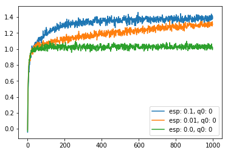
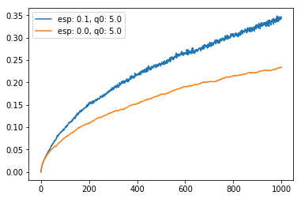

```python
%load_ext autoreload
%autoreload 2
%matplotlib inline

from matplotlib import pylab as plt
from environments import *
from agents import *
import itertools

from tqdm import *
```

    The autoreload extension is already loaded. To reload it, use:
      %reload_ext autoreload


# Chapter 2: Multi-armed Bandits 


```python
env = BanditEnvironment()
env.display()
```


    <matplotlib.axes._subplots.AxesSubplot at 0x129d5df60>


- Objective is to maximize the expected total reward over some time period, for example, over 1000 action selections, or time steps.
- If we call `q_a` the optical value for a specific action is the expected reward given than `a` is selected.
- A greedy action is an action that select the action with the highest `q_a` at each time step. How do we estimate those values ?


##  Greedy agent: Stationary problem

One simple way to do that is to estimate each action using the mean of the reward obatin for these action in the past experience.

```
q_a = Sum of reward obtain for a / Number a was chosen
```

If we maintain an estimate of `q_a` this way, we can just choose the action a with the hight value `q_a`.

To encourage a bit of exploration though, we are going to choose with a proba equal to (1-epsilon) and random action.

We can easily update the action values estimate

```
q_a(t+1) = q_a(t)+ alpha(R-q_a)
```

where R is the reward obtain when chosing action a at time t. `alpha` is often called the learning rate. It can be set to `1/N_a` here.

This update rule can be generalize as followed.

```
NewEstimate -> OldEstimate + alpha(Target-OldEstimate)
```

Given this rule, the pseudo code is

```
q_a = 0
N_a = 1
while eternity:
   if prob > epsilon:
      a = argmax(q_a)
   else:
      a = random
    reward = env.step(a)
    q_a += 1/N_a(R-q_a)
    N_a +=1
```


```python
results = []
for epsilon in [0.1,0.01,0.0]:
    agents = []
    for _ in tqdm(range(2000)):
        env = BanditEnvironment()
        agent = GreedyBanditAgent(epsilon=epsilon,learning_rate=None,action_space=10)
        for _ in range(1000):
            action = agent.choose()
            reward = env.step(action)
            agent.update_agent(action,reward)
        agents.append(agent)
    rewards = np.vstack([np.array(agent.rewards)[:,1] for agent in agents])
    results.append((epsilon,q0,rewards))
```

    100%|██████████| 2000/2000 [01:53<00:00, 17.66it/s]
    100%|██████████| 2000/2000 [02:02<00:00, 16.34it/s]
    100%|██████████| 2000/2000 [02:08<00:00, 15.52it/s]


```python
for espilon,q0,r in results:
    q0=0
    plt.plot(r.mean(axis=0),label='esp: {}, q0: {}'.format(espilon,q0))
plt.legend()
```


    <matplotlib.legend.Legend at 0x129ea2f60>





##  Greedy agent: Non-Stationary problem


```python
results = []
for epsilon in [0.1,0.0]:
    agents = []
    for _ in tqdm(range(2000)):
        env = RandomWalkBanditEnvironment()
        agent = GreedyBanditAgent(epsilon=epsilon,learning_rate=None,action_space=10)
        for _ in range(1000):
            action = agent.choose()
            reward = env.step(action)
            agent.update_agent(action,reward)
        agents.append(agent)
    rewards = np.vstack([np.array(agent.rewards)[:,1] for agent in agents])
    results.append((epsilon,q0,rewards))
```

    100%|██████████| 2000/2000 [02:05<00:00, 15.97it/s]
    100%|██████████| 2000/2000 [02:08<00:00, 15.51it/s]


```python
for espilon,q0,r in results:
    plt.plot(r.mean(axis=0),label='esp: {}, q0: {}'.format(espilon,q0))
plt.legend()
```


    <matplotlib.legend.Legend at 0x116ea1630>





## Greedy agent: Optimistic Initial Values

The algo depends on our initial estimate for `q_a`. One way to encourage exploration is the beginning is too you a large initialization value, larger than the maximum expected reward.

```python
results = []
epsilons = [0.1,0.0]
q0s = [0.0,5.0]
for epsilon,q0 in itertools.product(epsilons,q0s):
    agents = []
    for _ in tqdm(range(2000)):
        env = BanditEnvironment()
        agent = GreedyBanditAgent(epsilon=epsilon,learning_rate=None,action_space=10,q0=q0)
        for _ in range(1000):
            action = agent.choose()
            reward = env.step(action)
            agent.update_agent(action,reward)
        agents.append(agent)
    rewards = np.vstack([np.array(agent.rewards)[:,1] for agent in agents])
    results.append((epsilon,q0,rewards))
```


    array([-1.6478532 , -1.01169689, -0.55453591, -0.49379001,  1.99072134,
           -0.85237079, -0.52802086, -0.99158036, -0.32539335, -0.90624318])


```python
for espilon,q0,r in results:
    plt.plot(r.mean(axis=0),label='esp: {}, q0: {}'.format(espilon,q0))
plt.legend()
```

# Upper-Confidence-Bound agent.


The idea of this upper confidence bound (UCB) action selection is that the square-root term is a measure of the uncertainty or variance in the estimate of a’s value. The quantity being max’ed over is thus a sort of upper bound on the possible true value of action a, with c determining the confidence level.

```python
results = []
for agent_mode in ['UCB','greedy']:
    agents = []
    for _ in tqdm(range(2000)):
        env = BanditEnvironment()
        if agent_mode == 'UCB':
            agent = UCBBanditAgent(c=2,learning_rate=None,action_space=10)
        else:
            agent = GreedyBanditAgent(epsilon=0.1,learning_rate=None,action_space=10)
        for _ in range(1000):
            action = agent.choose()
            reward = env.step(action)
            agent.update_agent(action,reward)
        agents.append(agent)
    rewards = np.vstack([np.array(agent.rewards)[:,1] for agent in agents])
    results.append((agent_mode,rewards))
```

    100%|██████████| 2000/2000 [02:55<00:00, 11.43it/s]
    100%|██████████| 2000/2000 [01:53<00:00, 17.69it/s]


```python
for agent_mode,r in results:
    plt.plot(r.mean(axis=0),label='mode {}'.format(agent_mode))
plt.legend()
```
